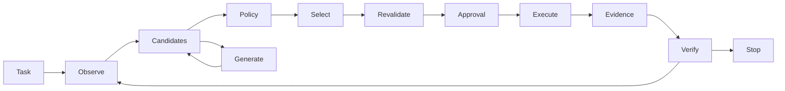

# Architecture

S1Code's native engine owns observation, candidate construction, deterministic
filtering, optional bounded selection, revalidation, execution, durable evidence,
and verification. A provider returns proposals or typed decisions; it never owns
local execution. Exact facts such as hashes, exit codes and permissions stay in code.

A single Cargo package keeps the boundaries small:

- `domain` holds serializable actions, candidates, artifact references, events,
  configuration, metrics and statuses.
- `engine` builds candidates from literal task identifiers, search hits and model
  proposals, applies policy, selects only when ambiguous, and checks for no progress.
- `decisions` implements TypeSafe's typed contract, bounded retries, exact caching,
  configurable request limits and validated Choice/Noul/Score answers.
- `generation` implements streaming Responses with a strict proposal schema. The
  same provider is used for an optional constrained generative selection baseline.
- `tools` owns bounded file operations, generated review diffs, journaled patch
  replacement, process groups and read-only Git inspection.
- `policy` classifies actions and binds identity to complete arguments, workspace
  revision and policy version. Denies cannot be overridden by scores or approvals.
- `context` manages full evidence versus explicit eviction placeholders, group
  retention and dependency closure. `session` stores journals/checkpoints/artifacts.
- `bridge` owns only the official Codex local protocol connection and surrounding
  session. It does not call native tools for upstream requests.
- `ui` and the headless command consume the same engine events. `evaluation` owns
  disposable fixtures and protected checks outside the native workspace root.

## Native control and verification

All candidates carry typed complete arguments, provenance, evidence IDs and a
snapshot revision. Relevant hash/path/schema facts are checked before selection and
again before execution. Patches carry each original file hash. One concrete
admissible action plus generation escape does not require a decision API call.
Ambiguous options may use rules, Jev or constrained generation. A repeated action
on unchanged state is bounded; generation fingerprints also include current evidence.

Generation can plan, search, diagnose or patch. All such calls are counted. It
receives the stable runtime instructions, current task and active evidence, with
capture revisions marked historical when they differ from the observed workspace.
Repository instructions cannot change policy or confer permissions.

Completion requires a successful verification command for the current workspace
revision and a generated completion proposal. Tests that mutate tracked working
content invalidate verification. A passing check is evidence, not proof of full
correctness; fixture evaluation separately runs protected assertions.
Resume invalidates previous verification when the observed workspace has changed.

## Persistence and interruption

Storage version 1 is independent of display/configuration naming in `brand`.
Canonical captured content lives in SHA-256-addressed files. Append-only JSONL events
are synced, then an atomic checkpoint replacement records the active working set.
The journal may be ahead after a crash: resume treats that as uncertainty rather
than guessing that an effect did or did not happen. A partial journal tail is a
reported integrity error; it is not silently deleted.

Before a tool starts, its intent is checkpointed. Patches validate every file, retain
original artifacts and write a recovery manifest before the first replacement.
Individual replacements are atomic; the set of files is not. Recovery checks all
current hashes and refuses to discard subsequent user changes. A native writer lock
covers one canonical workspace across data-directory choices. Other editors remain
independent, and adversarial filesystem races are outside the trust model.

Context budget pressure starts eviction at 85% and aims for 65%. Recent groups,
trusted task constraints, pending approval state, unresolved diagnostics, active
patches and their dependencies remain protected. Eviction changes only the working
set. Eviction removes dependent evidence with its prerequisites. `rehydrate` retrieves
captured bytes and moves the complete group and dependency closure into recent
context without repeating a command. Provider request budgets and context working-set
budgets are separate. If protected evidence cannot fit, the run stops explicitly.

## Delegated ownership

Codex mode requests the official runtime's managed ChatGPT authentication, threads,
turns and approvals. The CLI version/schema boundary is explicit. Read-only sandbox
and granular approval gates are verified before any turn. S1Code forwards requests to
the user, handles unknown requests conservatively, and never executes them twice.

A saved active turn is reattached; stopped turns are observed without replay. An
explicit `--continue-task` requests another turn on the existing thread. Unknown
turn completion is not silently retried. Delegations, upstream verification and
unknown internal usage are reported separately from native tool/model metrics.
No hidden reasoning, upstream context ownership or per-model-call accounting is
claimed for this mode.

## Rename and storage compatibility

The executable/package is now `s1code`, displayed as S1Code. Storage remains
version 1. `--home` takes precedence, then `S1CODE_HOME`, then the legacy
`NERVE_HOME`. Without an override, an existing legacy `nerve` data directory with
sessions is reused in place when the new directory does not exist. No records are
moved, merged, or deleted automatically. If both stores exist, use `--home` to
select the older one. Old binaries are not removed by building the new executable.
The v1 workspace-lock namespace also stays unchanged so running an old executable
alongside S1Code cannot introduce a second writer to the same workspace.

Native generation selection is explicit (`openai` or `claude`), recorded in each
session and the evaluation report. Old v1 records default to OpenAI. The default
interactive entry selects the labeled Codex bridge; native CLI `run` defaults remain
OpenAI/rules. The task-entry UI is independent of the engine. See ADR 003 for Claude
API versus official terminal-handoff ownership and the absence of inherited task
context between new prompts.

Native conversations now retain exact prior user requests across bounded follow-ups.
Jev receives focused relevance snapshots and adaptive retention batches; full
arguments remain in the runtime. See [ADR 008](adr/008-bounded-followups-and-decisions.md)
for budget ownership, context dependencies and recoverable directory creation.
